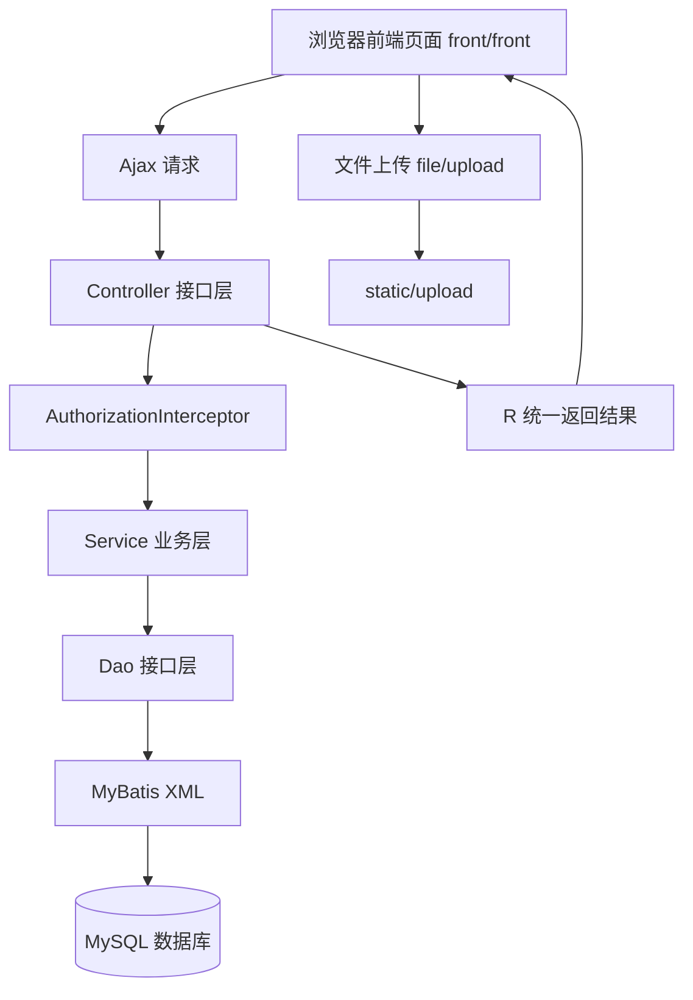
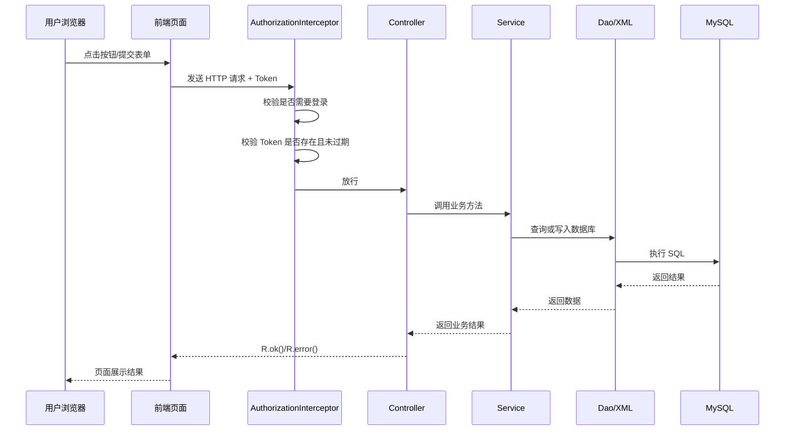
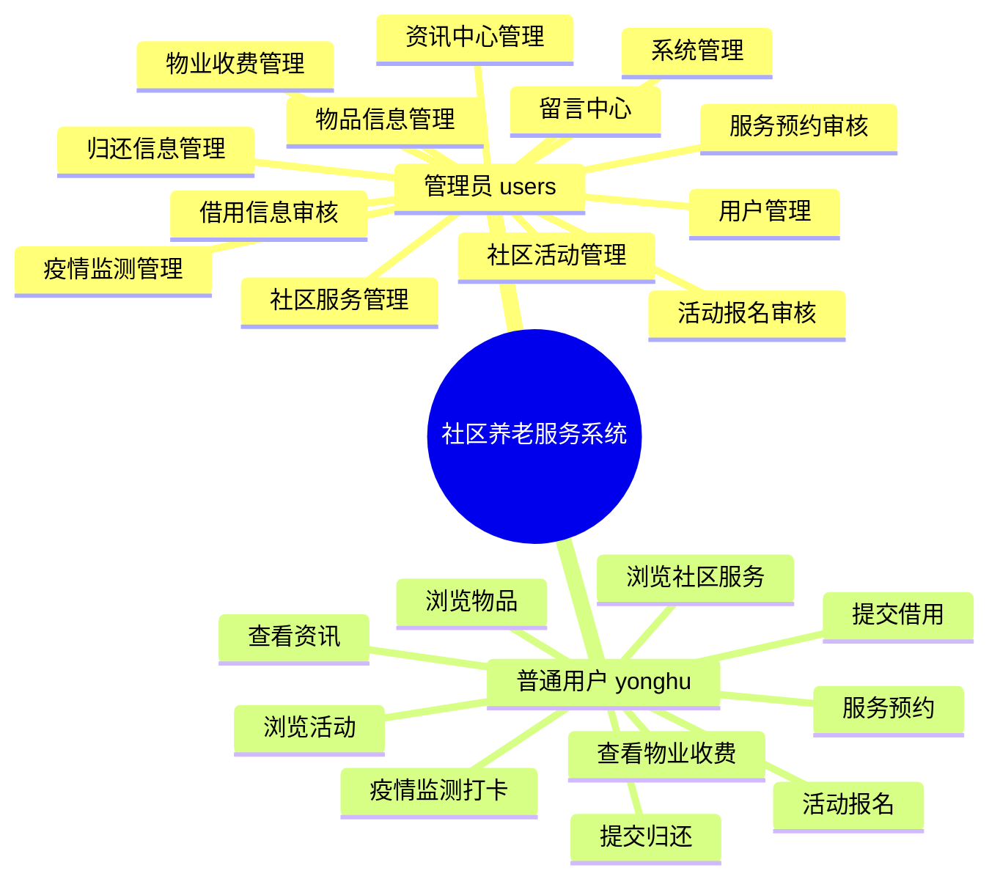
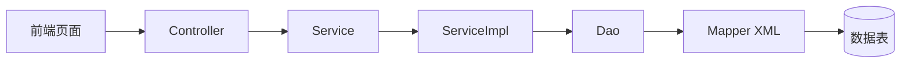
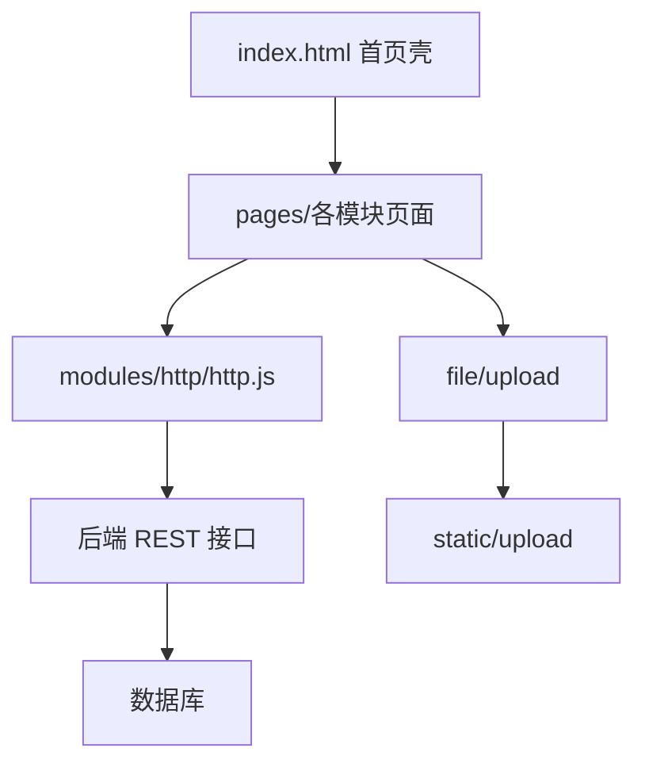
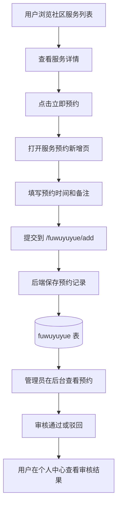
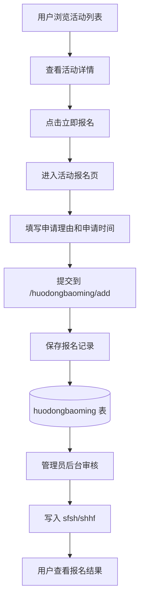
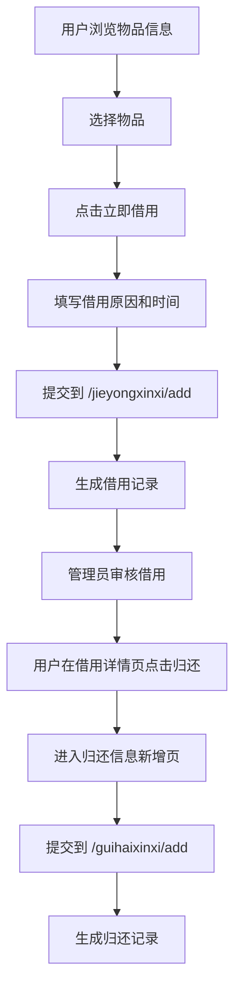

# 社区养老服务系统项目教程

> 适用对象：第一次接触 Spring Boot、MyBatis-Plus、传统前后端页面整合项目的初学者  
> 项目位置：`back`  
> 后端技术：Spring Boot 2.2.2 + MyBatis-Plus 2.x + MySQL  
> 前端形态：静态页面直接放在后端工程中，通过 Ajax 调用后端接口

---

## 1. 这个项目是做什么的

这是一个“社区养老服务系统”后端工程。它的目标不是只做一个简单登录页，而是围绕社区老年用户的日常服务，提供一整套业务模块，例如：

- 用户信息管理
- 社区服务展示与预约
- 社区活动展示与报名
- 物品信息展示、借用与归还
- 物业收费管理
- 疫情监测打卡
- 资讯中心
- 意见留言
- 收藏、点赞、评论、统计等辅助功能

从代码来看，这个项目属于典型的“代码生成模板型管理系统”：

- 后端大量模块结构一致，都是 `Controller -> Service -> Dao -> XML -> 数据表`
- 前端是静态 HTML 页面 + Vue + Layui + jQuery
- 认证依赖 `Token` 请求头
- 权限和菜单主要由前端配置控制

如果你是初学者，可以把这个项目理解成：

1. 一个 Spring Boot Web 项目
2. 一个数据库驱动的业务管理系统
3. 一个把前端页面和后端接口都放在同一工程里的完整示例

---

## 2. 技术栈总览

根据 `pom.xml` 和源码，可以整理出项目的主要技术栈：

### 2.1 后端

- Spring Boot 2.2.2.RELEASE
- Spring MVC
- MyBatis
- MyBatis-Plus 2.3
- MySQL
- Apache Shiro 依赖已引入，但本项目实际更核心的是自定义 `AuthorizationInterceptor`
- Fastjson
- Hutool
- Apache POI
- 百度 AI SDK

### 2.2 前端

- Vue
- jQuery
- Layui
- Bootstrap
- Element UI
- 静态 HTML 页面

### 2.3 运行环境

- JDK 1.8
- Maven
- MySQL 5.7/8.x 均可尝试

---

## 3. 项目目录怎么读

初学者看项目，最怕一上来文件太多。建议先只抓主干。

### 3.1 最重要的目录

```text
back
├─ pom.xml
├─ src
│  ├─ main
│  │  ├─ java/com
│  │  │  ├─ SpringbootSchemaApplication.java
│  │  │  ├─ controller
│  │  │  ├─ service
│  │  │  ├─ service/impl
│  │  │  ├─ dao
│  │  │  ├─ entity
│  │  │  ├─ interceptor
│  │  │  ├─ annotation
│  │  │  └─ utils
│  │  └─ resources
│  │     ├─ application.yml
│  │     ├─ mapper
│  │     ├─ static
│  │     └─ front/front
│  └─ test
└─ target
```

### 3.2 每个目录是干什么的

#### `src/main/java/com`

这是 Java 代码主目录。

- `controller`：接口入口层，浏览器或前端请求首先到这里
- `service`：业务接口层
- `service/impl`：业务实现层
- `dao`：数据库访问接口
- `entity`：数据库表对应的实体类
- `interceptor`：拦截器，负责登录令牌校验
- `annotation`：自定义注解，比如哪些接口不需要登录
- `utils`：分页、返回结果、SQL 过滤等工具类

#### `src/main/resources/application.yml`

这是项目的核心配置文件，里面定义了：

- 端口
- 项目访问路径
- 数据库连接
- 文件上传大小
- MyBatis-Plus 配置

#### `src/main/resources/mapper`

这里放 MyBatis XML 映射文件。

可以把它理解为“真正执行 SQL 的地方”。

#### `src/main/resources/static`

这里是静态资源目录，尤其是上传文件会保存在 `static/upload`。

#### `src/main/resources/front/front`

这里是前端页面目录。  
这个项目不是 Vue CLI/Vite 那种前后端分离工程，而是把页面直接放在资源目录中。

---

## 4. 项目如何启动

### 4.1 启动类

启动类是：

`src/main/java/com/SpringbootSchemaApplication.java`

它做了两件重要事情：

- 标记这是一个 Spring Boot 应用
- 扫描 `com.dao` 下的 Mapper 接口

### 4.2 访问配置

`application.yml` 中的重要配置如下：

- 端口：`8080`
- 项目上下文路径：`/springboot654g2`
- 数据库：`jdbc:mysql://127.0.0.1:3306/t253`

所以后端根地址是：

```text
http://localhost:8080/springboot654g2/
```

### 4.3 前端接口基础地址

前端请求基础地址写死在：

`src/main/resources/front/front/modules/http/http.js`

```js
baseurl = "http://localhost:8080/springboot654g2/";
```

这意味着：

- 如果你改了端口或 context-path
- 前端这里也要跟着改

### 4.4 启动步骤

#### 第一步：准备数据库

你需要先创建数据库：

```sql
create database t253 default character set utf8mb4;
```

注意：我在当前代码仓库里没有看到现成的 `.sql` 初始化脚本，所以数据表结构可能来自项目原始发布包或数据库导出文件。  
这点对初学者非常重要，因为“代码能看懂”和“项目能直接跑起来”是两件事。

#### 第二步：修改数据库账号密码

编辑 `src/main/resources/application.yml`：

```yml
spring:
  datasource:
    username: root
    password: 123456
```

改成你本机 MySQL 的账号密码。

#### 第三步：使用 Maven 启动

```bash
mvn spring-boot:run
```

或者在 IDEA 中直接运行 `SpringbootSchemaApplication`。

---

## 5. 项目整体架构图

先看总架构，再看细节会更轻松。



这个图说明了项目最核心的运行方式：

- 页面发请求
- 请求进入控制器
- 需要登录的接口会先过拦截器
- 然后调用业务层和数据库
- 最后把统一格式的 JSON 返回给页面

---

## 6. 一个请求是怎么流转的

### 6.1 统一返回格式

项目使用 `com.utils.R` 封装返回值。

成功时常见结构：

```json
{
  "code": 0,
  "data": ...
}
```

失败时常见结构：

```json
{
  "code": 500,
  "msg": "错误信息"
}
```

### 6.2 请求链路图



---

## 7. 认证与权限是怎么做的

这是这个项目必须看懂的一块。

### 7.1 登录接口分成两类

#### 后台管理员/系统用户

接口在：

- `src/main/java/com/controller/UserController.java`

登录路径：

```text
/users/login
```

它查询的是 `users` 表对应的 `UserEntity`。

#### 前台普通用户

接口在：

- `src/main/java/com/controller/YonghuController.java`

登录路径：

```text
/yonghu/login
```

它查询的是 `yonghu` 表对应的 `YonghuEntity`。

### 7.2 Token 如何生成

Token 逻辑在：

- `src/main/java/com/service/impl/TokenServiceImpl.java`

关键点：

- 登录成功后生成一个 32 位随机字符串
- 过期时间默认是 1 小时
- Token 会保存到 `token` 表

### 7.3 请求如何校验 Token

校验逻辑在：

- `src/main/java/com/interceptor/AuthorizationInterceptor.java`

它做的事情：

1. 读取请求头中的 `Token`
2. 判断当前接口是否带有 `@IgnoreAuth`
3. 如果不忽略认证，就去 `token` 表查这个 Token
4. 如果有效，就把用户信息放进 `session`
5. 如果无效，就返回 401

### 7.4 session 中保存了什么

拦截器会写入：

- `userId`
- `role`
- `tableName`
- `username`

这四个值很重要，因为很多业务控制器会根据 `tableName` 和 `username` 判断：

- 当前登录的是不是普通用户
- 是否只允许查看自己的数据

例如：

- 服务预约
- 活动报名
- 借用信息
- 归还信息
- 物业收费

这些模块里都能看到类似逻辑：

```java
if(tableName.equals("yonghu")) {
    entity.setYonghuzhanghao((String)request.getSession().getAttribute("username"));
}
```

意思是：如果当前登录的是普通用户，那么查询结果只看自己的记录。

### 7.5 权限的真正样子

这个项目的权限是“后端拦截 + 前端菜单控制”的组合方式。

更准确地说：

- 后端负责校验是否登录
- 前端根据角色菜单决定“显示哪些按钮”

前端菜单配置在：

- `src/main/resources/front/front/js/config.js`

里面定义了两个核心角色：

- `users`：管理员
- `yonghu`：普通用户

每个角色都有：

- 后台菜单 `backMenu`
- 前台菜单 `frontMenu`
- 按钮权限 `buttons`

---

## 8. 菜单与角色怎么理解

`front/front/js/config.js` 里有一大段 `menu` 配置，它不是普通 UI 配置，而是这个项目的“角色能力描述”。

你可以这样理解：

- 管理员能管理几乎所有模块
- 普通用户能看前台内容，也能操作自己的预约、报名、借用、疫情监测、物业收费等

### 8.1 管理员主要功能

- 用户管理
- 服务分类管理
- 社区服务管理
- 服务预约审核
- 物品分类和物品信息管理
- 借用信息审核
- 归还信息管理
- 活动分类和活动管理
- 活动报名审核
- 疫情监测管理
- 物业收费管理和统计
- 资讯中心管理
- 留言回复
- 系统菜单与轮播图配置

### 8.2 普通用户主要功能

- 浏览社区服务并预约
- 浏览物品信息并借用
- 浏览社区活动并报名
- 查看资讯
- 管理自己的预约、借用、归还、报名
- 做疫情监测打卡
- 查看物业收费并支付

### 8.3 菜单结构图



---

## 9. 后端代码结构怎么读

这个项目每个业务模块的结构都几乎一样。  
初学者只要吃透一个模块，其他模块基本都能举一反三。

### 9.1 以“社区服务”为例

对应文件通常是：

- `ShequfuwuEntity.java`：实体类
- `ShequfuwuDao.java`：数据库接口
- `ShequfuwuService.java`：服务接口
- `ShequfuwuServiceImpl.java`：服务实现
- `ShequfuwuController.java`：控制器
- `ShequfuwuDao.xml`：SQL 映射

### 9.2 标准分层图



### 9.3 Controller 常见接口模板

几乎每个业务模块都有这些接口：

- `/page`：后台分页
- `/list`：前台分页
- `/lists`：列表
- `/query`：条件查询
- `/info/{id}`：后台详情
- `/detail/{id}`：前台详情
- `/save`：后台新增
- `/add`：前台新增
- `/update`：修改
- `/delete`：删除
- `/remind/...`：提醒统计

所以你会发现，这不是“每个模块都人工重写一套逻辑”，而是“统一模板 + 不同字段”。

---

## 10. 前端结构怎么读

### 10.1 首页入口

前端首页在：

- `src/main/resources/front/front/index.html`

这个页面本质上是一个外壳，它通过 `iframe` 加载各个子页面。

### 10.2 页面目录

各业务页面都在：

- `src/main/resources/front/front/pages`

例如：

- `shequfuwu`：社区服务
- `fuwuyuyue`：服务预约
- `wupinxinxi`：物品信息
- `jieyongxinxi`：借用信息
- `guihaixinxi`：归还信息
- `shequhuodong`：社区活动
- `huodongbaoming`：活动报名
- `yiqingjiance`：疫情监测
- `wuyeshoufei`：物业收费
- `zixunzhongxin`：资讯中心
- `messages`：意见中心

### 10.3 前端请求封装

前端 Ajax 工具在：

- `src/main/resources/front/front/modules/http/http.js`

它负责：

- 拼接基础地址
- 自动加 `Token` 请求头
- 统一处理未登录跳转
- 提供普通表单请求、JSON 请求和文件上传

### 10.4 前端和后端关系图



---

## 11. 关键业务模块逐个理解

下面这一部分最重要，因为它真正回答“这个系统在业务上做了什么”。

### 11.1 用户模块 `yonghu`

对应实体：

- `YonghuEntity.java`

核心字段：

- 用户账号 `yonghuzhanghao`
- 密码 `mima`
- 用户姓名 `yonghuxingming`
- 照片 `zhaopian`
- 性别 `xingbie`
- 家庭住址 `jiatingzhuzhi`
- 联系方式 `lianxifangshi`
- 亲属姓名/关系
- 紧急电话
- 疾病史
- 备注

这说明系统里的“普通用户”不是抽象账号，而是带有养老场景信息的老人档案。

### 11.2 社区服务 `shequfuwu`

对应实体：

- `ShequfuwuEntity.java`

核心字段：

- 服务名称
- 图片
- 服务种类
- 工作时间
- 服务详情
- 点赞/踩
- 点击量

它扮演的是“服务目录”角色，相当于系统里的可预约服务清单。

### 11.3 服务预约 `fuwuyuyue`

对应实体：

- `FuwuyuyueEntity.java`

核心字段：

- 预约编号
- 服务名称
- 服务分类
- 预约备注
- 预约时间
- 用户账号/姓名/联系方式
- 是否审核 `sfsh`
- 审核回复 `shhf`

这说明该模块不是即时接单，而是“用户提交申请，后台审核”的模式。

### 11.4 物品信息 `wupinxinxi`

对应实体：

- `WupinxinxiEntity.java`

核心字段：

- 物品名称
- 图片
- 物品种类
- 物品数量
- 物品详情

这是可借用物品的基础资料表。

### 11.5 借用信息 `jieyongxinxi`

对应实体：

- `JieyongxinxiEntity.java`

核心字段：

- 物品名称、种类、数量
- 借用原因
- 借用时间
- 用户信息
- 是否审核
- 审核回复

它和服务预约非常像，也是“用户提交申请，后台审核”。

### 11.6 归还信息 `guihaixinxi`

对应实体：

- `GuihaixinxiEntity.java`

核心字段：

- 物品名称、种类、数量
- 归还时间
- 用户信息

注意：从代码看，归还信息和借用信息是两个独立表。  
前端在借用详情页提供“归还”按钮，跳转生成归还记录。

### 11.7 社区活动 `shequhuodong`

对应实体：

- `ShequhuodongEntity.java`

核心字段：

- 活动标题
- 活动图片
- 活动分类
- 活动地点
- 开始时间、结束时间
- 活动详情
- 点赞/踩

它扮演的是“活动公告/活动展示”角色。

### 11.8 活动报名 `huodongbaoming`

对应实体：

- `HuodongbaomingEntity.java`

核心字段：

- 报名编号
- 活动标题
- 活动地点
- 申请理由
- 申请时间
- 用户信息
- 是否审核
- 审核回复

这也是典型的“申请 + 审核”模式。

### 11.9 疫情监测 `yiqingjiance`

对应实体：

- `YiqingjianceEntity.java`

核心字段：

- 打卡编号
- 健康码
- 当天体温
- 是否发热 / 咳嗽 / 密接
- 打卡时间
- 用户信息
- 经度、纬度、地址

这说明系统曾包含疫情期间的健康打卡场景。

### 11.10 物业收费 `wuyeshoufei`

对应实体：

- `WuyeshoufeiEntity.java`

核心字段：

- 收费月份
- 用户信息
- 物业费
- 绿化养护
- 清洁卫生
- 其他收费
- 总金额
- 是否支付 `ispay`

从控制器还能看到，它支持按值统计和分组统计，适合做图表展示。

### 11.11 资讯中心 `zixunzhongxin`

对应实体：

- `ZixunzhongxinEntity.java`

核心字段：

- 资讯标题
- 封面
- 资讯内容
- 发布时间

这是内容发布模块。

### 11.12 留言中心 `messages`

对应实体：

- `MessagesEntity.java`

核心字段：

- 留言用户 id
- 用户名
- 留言内容
- 留言图片
- 回复内容
- 回复图片

这是用户意见反馈模块。

### 11.13 收藏表 `storeup`

对应实体：

- `StoreupEntity.java`

它不只是收藏，还兼顾：

- 收藏
- 点赞
- 踩
- 推荐类型记录

例如 `ShequfuwuController` 里的 `autoSort2()`，就是根据收藏里的 `inteltype` 做简单推荐。

---

## 12. 三条最值得初学者看懂的业务流程

---

### 12.1 流程一：社区服务预约

这是系统里最标准的一条业务线。

#### 涉及模块

- 社区服务：`shequfuwu`
- 服务预约：`fuwuyuyue`

#### 页面动作

用户在社区服务详情页点击“立即预约”，前端跳转到预约新增页，并把服务信息带过去。

#### 后端动作

- 前端提交 `/fuwuyuyue/add`
- 后端插入预约记录
- 管理员后续审核 `sfsh` 和 `shhf`

#### 流程图



#### 初学者要注意

- 预约记录里保留了服务名称、分类和用户信息，这是一种“冗余保存”的设计
- 这样做的好处是查询方便
- 缺点是如果原始服务名称变了，历史预约记录不会自动同步

---

### 12.2 流程二：社区活动报名

#### 涉及模块

- 社区活动：`shequhuodong`
- 活动报名：`huodongbaoming`

#### 流程图



#### 和服务预约的相同点

- 都是前台提交、后台审核
- 都会把当前登录用户绑定到记录上
- 普通用户分页查询时只看自己的数据

#### 不同点

- 活动报名强调“活动地点、申请理由、申请日期”
- 服务预约强调“预约时间、服务备注”

---

### 12.3 流程三：物品借用与归还

这是这个项目里最贴近“完整生命周期”的业务链。

#### 涉及模块

- 物品信息：`wupinxinxi`
- 借用信息：`jieyongxinxi`
- 归还信息：`guihaixinxi`

#### 流程图



#### 这条业务线的特点

- 借用和归还分开存表
- 借用有审核字段
- 归还目前从代码看是直接新增归还记录，没有看到自动回写借用状态

#### 这意味着什么

如果后续要增强系统，最值得改造的地方之一就是：

- 给借用记录增加借用状态
- 归还时自动更新借用状态
- 同时扣减/恢复物品库存

也就是说，这个项目现在更偏“信息登记系统”，还不是严格的“库存流转系统”。

---

## 13. 统计与通用能力

### 13.1 通用接口 `CommonController`

这个控制器提供了一些非常像“后台生成器能力”的接口：

- 下拉选项联动 `/option/...`
- 单条跟随查询 `/follow/...`
- 审核接口 `/sh/{tableName}`
- 提醒计数 `/remind/...`
- 求和 `/cal/...`
- 分组统计 `/group/...`
- 值统计 `/value/...`
- 时间维度统计 `/value/.../.../...`
- 人脸比对 `/matchFace`

### 13.2 统计能力最明显的模块

`WuyeshoufeiController` 额外提供了：

- 按值统计
- 按时间统计
- 分组统计

这说明物业收费模块不仅能 CRUD，还能做报表。

---

## 14. 文件上传是怎么做的

文件上传控制器：

- `src/main/java/com/controller/FileController.java`

### 14.1 上传逻辑

上传地址：

```text
/file/upload
```

上传后的文件保存在：

```text
classpath:static/upload/
```

默认文件名规则：

- 时间戳 + 原始后缀

### 14.2 下载逻辑

下载地址：

```text
/file/download?fileName=xxx
```

### 14.3 初学者要注意的坑

代码里特别写了注释说明：

- 如果你用 IDEA 或 Eclipse 重启项目
- 上传文件可能丢失

所以作者建议把上传文件额外复制到项目真实目录。  
目前那行代码是注释掉的，需要你自己根据本地路径修改。

这说明当前上传实现更适合教学和演示，不太适合正式生产环境。

---

## 15. 这个项目有哪些“模板型”特征

如果你多看几个控制器，会发现很多代码高度相似。这不是坏事，反而很适合初学者练习。

### 15.1 明显特征

- 各模块接口命名统一
- 各实体类结构统一
- `ServiceImpl` 大多是固定模板
- `MPUtil` 负责统一拼接查询条件
- `PageUtils` 负责统一分页
- `R` 负责统一返回

### 15.2 这对初学者的好处

- 读懂一个模块后，其他模块学习成本很低
- 很适合拿来练习增删改查
- 很适合学习“传统后台管理系统”是怎么搭起来的

### 15.3 这对项目维护的影响

- 开发速度快
- 但个性化业务逻辑较少
- 很多重要校验没有真正写深
- 安全性和一致性更依赖开发者后续补强

---

## 16. 初学者最应该重点看的源码文件

如果你时间有限，建议按这个顺序看：

### 第一阶段：先建立整体感觉

1. `pom.xml`
2. `src/main/resources/application.yml`
3. `src/main/java/com/SpringbootSchemaApplication.java`
4. `src/main/resources/front/front/js/config.js`
5. `src/main/resources/front/front/modules/http/http.js`

### 第二阶段：看登录与认证

1. `src/main/java/com/controller/UserController.java`
2. `src/main/java/com/controller/YonghuController.java`
3. `src/main/java/com/interceptor/AuthorizationInterceptor.java`
4. `src/main/java/com/service/impl/TokenServiceImpl.java`
5. `src/main/java/com/entity/TokenEntity.java`

### 第三阶段：只挑一个业务模块吃透

建议先看“社区服务预约”：

1. `ShequfuwuEntity`
2. `ShequfuwuController`
3. `FuwuyuyueEntity`
4. `FuwuyuyueController`
5. 前端 `pages/shequfuwu/detail.html`
6. 前端 `pages/fuwuyuyue/add.html`

### 第四阶段：再看另两条业务链

- 活动报名
- 借用与归还

---

## 17. 作为初学者，你可以从这个项目学到什么

### 17.1 Spring Boot 工程长什么样

你可以学到：

- 配置文件怎么写
- 启动类怎么写
- Controller 怎么接收请求

### 17.2 数据库业务系统怎么分层

你可以学到：

- 实体类对应数据表
- Service 和 Dao 的分工
- XML Mapper 如何参与查询

### 17.3 登录与拦截器怎么配合

你可以学到：

- 登录成功后怎么生成 Token
- 请求头如何带 Token
- 拦截器如何校验登录状态

### 17.4 静态页面如何调用后端接口

你可以学到：

- 前端如何封装 Ajax
- 页面如何发请求
- 页面如何渲染返回数据

### 17.5 一个完整业务是怎样落到表结构里的

例如：

- 服务展示表
- 服务预约表
- 审核字段
- 用户字段冗余保存

这些都是实际项目里常见的设计思路。

---

## 18. 这个项目目前的局限性

教程不能只讲优点，也要帮你看出真实情况。

### 18.1 安全性较弱

- 普通用户和管理员密码都是明文比较
- 没有看到真正启用的验证码校验
- 按钮权限更多靠前端隐藏

### 18.2 业务一致性不够强

- 借用和归还是分表记录，但没有看到完整状态流转
- 预约、报名、借用都保存了冗余字段
- 缺少更严格的数据库约束说明

### 18.3 工程形态偏传统

- 前端是大量静态页面，不是现代组件化工程
- 基础地址写死
- 上传目录方式更适合演示而非生产

### 18.4 仓库资料不完整

基于当前代码目录，我没有看到：

- 数据库初始化 SQL 文件
- 明确的 README
- 明确可运行的 `admin/dist` 资源目录

也就是说，这份代码非常适合“读源码学习”，但若要“一键跑通”，你可能还需要补数据库脚本和部分前端资源。

---

## 19. 给初学者的推荐阅读路线

### 路线 A：只想先跑起来

1. 配好 MySQL
2. 修改 `application.yml`
3. 启动 Spring Boot
4. 打开前端页面
5. 调接口测试登录

### 路线 B：想学后端

1. 看启动类和配置
2. 看 `R`、`PageUtils`、`Query`
3. 看登录与拦截器
4. 深入一个业务模块
5. 再类比其他模块

### 路线 C：想学业务系统设计

1. 先把所有实体类过一遍
2. 画出表之间的业务关系
3. 分析哪些表是“主数据”
4. 分析哪些表是“流程记录”
5. 找出哪些字段是审核、状态、统计字段

---

## 20. 一句话总结这个项目

这是一个典型的、适合初学者学习的 Spring Boot 社区养老服务管理系统示例。  
它的价值不在于架构多先进，而在于结构清楚、业务完整、模块统一，非常适合你用来练习：

- 读懂一个 Java Web 管理系统
- 理解 Controller/Service/Dao 分层
- 理解登录、Token、拦截器
- 理解预约、报名、借用、归还这类业务流

如果你接下来准备继续深入，最推荐你做两件事：

1. 自己补一张数据库表关系图
2. 自己选一个模块，完整跟踪“页面 -> 接口 -> Service -> SQL -> 数据表”

只要你把这一步走通，这个项目就真的读懂了。

