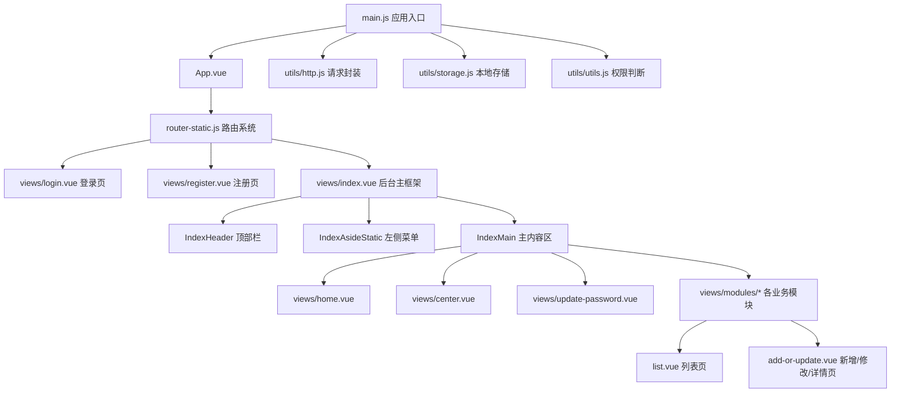
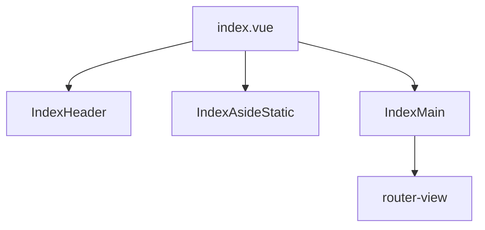
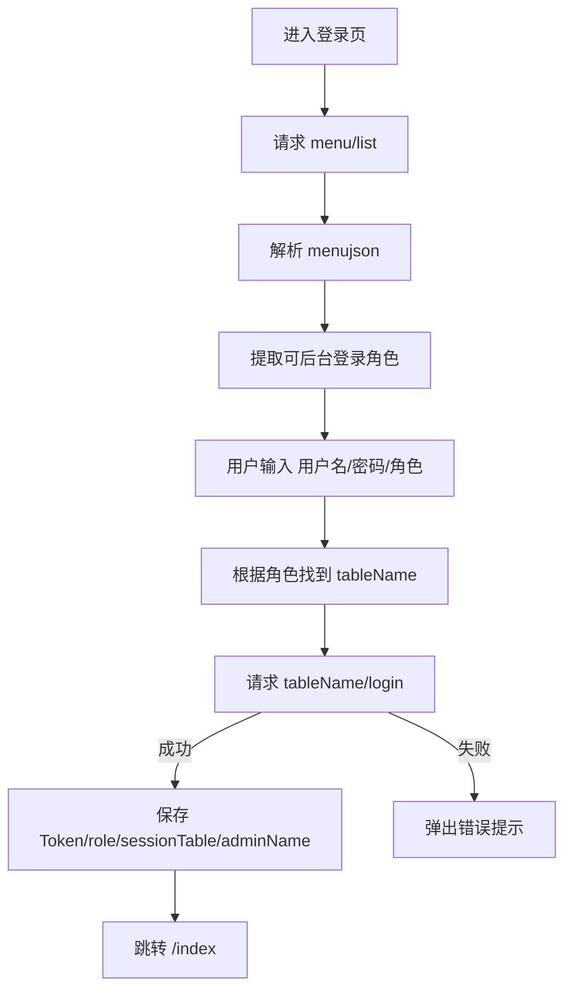
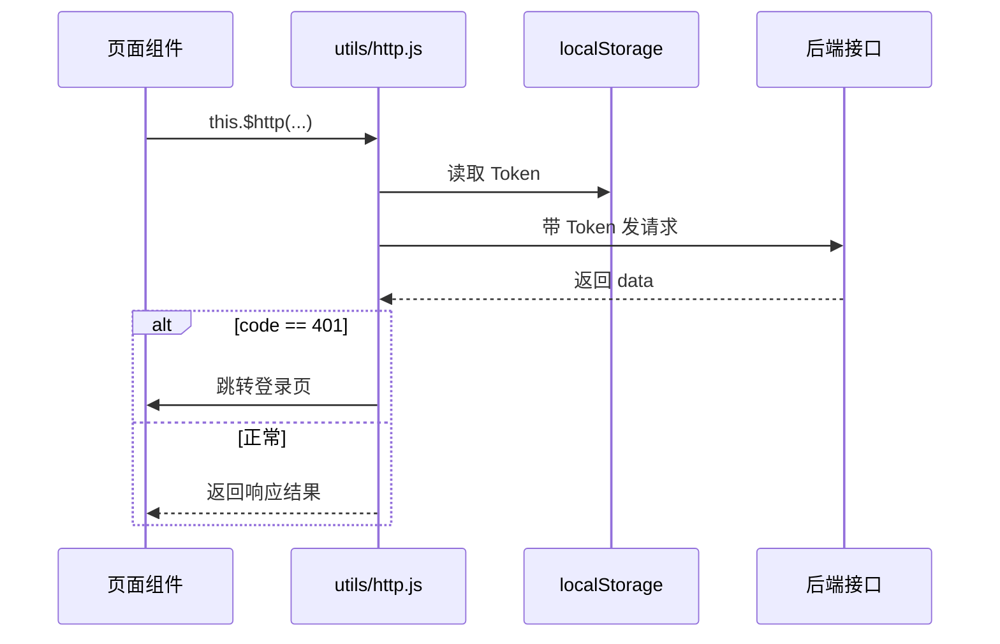
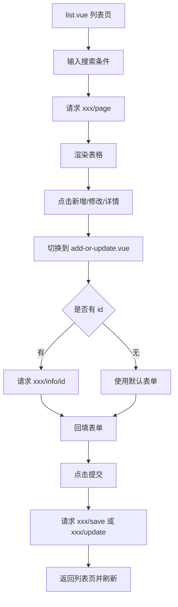
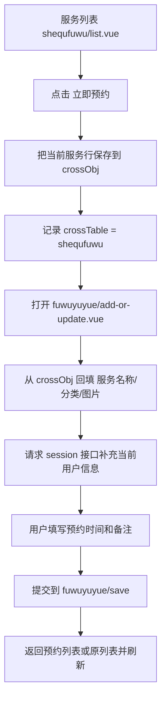
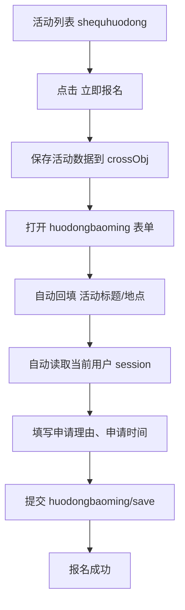
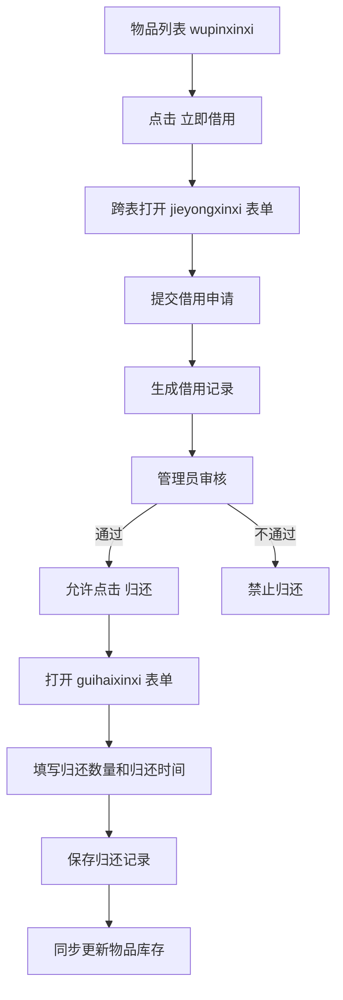

# 社区养老服务系统前端项目教程

## 1. 文档目标

这份文档面向刚接触 Vue 2 项目、Element UI 项目，或者第一次阅读本仓库代码的初学者。

阅读完后，你应该能回答下面这些问题：

- 这个项目是做什么的
- 项目怎么启动
- 页面是怎么组织起来的
- 登录、权限、菜单、请求分别在哪里处理
- 业务模块为什么看起来都很像
- “服务预约、活动报名、物品借用归还”这类业务是怎么在代码里串起来的
- 如果以后你想新增一个模块，大概要改哪些位置

---

## 2. 项目简介

从代码命名和页面模块可以看出，这是一个 **社区养老服务系统的后台前端**，基于 Vue 2 + Element UI 开发。

项目包含的核心业务主要有：

- 用户管理
- 社区服务管理
- 服务预约
- 社区活动管理
- 活动报名
- 咨询中心
- 物品信息管理
- 物品借用与归还
- 物业收费
- 疫情监测
- 评论管理
- 菜单与权限管理

这个项目很明显带有“代码生成模板”的特征：很多业务模块的页面结构、方法命名、接口命名都非常统一。

最典型的规律是：

- 每个模块基本都有 `list.vue`
- 大多数模块还有 `add-or-update.vue`
- 后端接口几乎都遵循：
  - `xxx/page`
  - `xxx/info/:id`
  - `xxx/save`
  - `xxx/update`
  - `xxx/delete`

这意味着：**学会一个模块，就能举一反三看懂大多数模块。**

---

## 3. 技术栈

根据 [package.json](/e:/A_CommunityElderlyCareServiceSystem-main/front/package.json) 可以确认：

- 前端框架：`Vue 2`
- UI 组件库：`Element UI`
- 路由：`vue-router`
- 请求库：`axios`
- 富文本：`vue-quill-editor`
- 图表：`echarts`
- 地图：`vue-amap`
- Excel 导出：`vue-json-excel`
- 打印：`print-js`
- 哈希：`js-md5`
- 构建工具：`Vue CLI 4`

---

## 4. 如何启动项目

### 4.1 安装依赖

仓库中已经存在 `node_modules`，但标准做法仍然是：

```bash
npm install
```

### 4.2 启动开发环境

```bash
npm run serve
```

默认开发端口在 [vue.config.js](/e:/A_CommunityElderlyCareServiceSystem-main/front/vue.config.js) 中配置为：

- 前端开发端口：`8081`
- 后端代理前缀：`/springboot654g2`
- 代理目标：`http://localhost:8080/springboot654g2/`

也就是说，通常需要同时启动后端项目，前后端配合运行。

### 4.3 打包

```bash
npm run build
```

---

## 5. 项目目录结构

先看 `src` 的核心结构：

```text
src
├─ App.vue
├─ main.js
├─ assets/           静态资源、全局样式
├─ components/       通用组件、后台主框架组件
├─ icons/            SVG 图标
├─ router/           路由配置
├─ store/            状态目录（本项目基本未实际使用）
├─ utils/            请求、存储、校验、权限等工具
└─ views/
   ├─ login.vue
   ├─ register.vue
   ├─ index.vue
   ├─ home.vue
   ├─ center.vue
   ├─ update-password.vue
   └─ modules/       各业务模块
```

### 5.1 架构图



---

## 6. 应用入口是怎么工作的

入口文件是 [src/main.js](/e:/A_CommunityElderlyCareServiceSystem-main/front/src/main.js)。

它主要做了几件事：

1. 注册 Vue 和 Element UI
2. 注册全局样式
3. 注入路由
4. 把常用工具挂到 `Vue.prototype`
5. 注册全局组件
6. 挂载整个应用

### 6.1 在 `main.js` 中挂载的全局能力

- `this.$http`：统一请求对象，来自 `utils/http.js`
- `this.$base`：基础配置，来自 `utils/base.js`
- `this.$storage`：本地存储封装，来自 `utils/storage.js`
- `this.$api`：部分接口常量，来自 `utils/api.js`
- `this.$validate`：校验工具
- `this.$echarts`：图表库
- `this.isAuth()`：权限判断函数
- `this.getCurDate()` / `this.getCurDateTime()`：时间工具

这也是你在各个 `.vue` 页面里经常能看到 `this.$http(...)`、`this.$storage.get(...)` 的原因。

---

## 7. 路由系统

路由文件是 [src/router/router-static.js](/e:/A_CommunityElderlyCareServiceSystem-main/front/src/router/router-static.js)。

这个项目采用的是 **静态路由注册**。

特点是：

- 登录页、注册页单独挂在一级路由
- 后台页面统一挂在 `/index` 下
- 每个业务模块直接 import 对应的 `list.vue`
- 使用 `hash` 模式

### 7.1 路由分层

```mermaid
graph LR
    A[/] --> B[/index]
    A --> C[/login]
    A --> D[/register]
    B --> E[/]
    B --> F[/center]
    B --> G[/updatePassword]
    B --> H[/shequfuwu]
    B --> I[/shequhuodong]
    B --> J[/wupinxinxi]
    B --> K[/jieyongxinxi]
    B --> L[/guihaixinxi]
```

### 7.2 初学者要注意

- 虽然左侧菜单看起来是动态的，但路由本身还是提前写死在 `router-static.js` 里的
- 菜单控制的是“显示什么”和“有没有按钮权限”，不是完全动态生成页面文件

---

## 8. 后台整体布局

后台入口页是 [src/views/index.vue](/e:/A_CommunityElderlyCareServiceSystem-main/front/src/views/index.vue)。

它本身非常简单，只是把后台分成三块：

- 顶部：`IndexHeader`
- 左侧：`IndexAsideStatic`
- 主体：`IndexMain`

### 8.1 结构图



### 8.2 各部分职责

#### 顶部栏 `IndexHeader`

文件： [src/components/index/IndexHeader.vue](/e:/A_CommunityElderlyCareServiceSystem-main/front/src/components/index/IndexHeader.vue)

负责：

- 显示项目名称
- 显示当前角色和用户名
- 获取当前登录用户信息
- 保存当前用户 `id`
- 退出登录
- 非管理员时可“退出到前台”

#### 左侧菜单 `IndexAsideStatic`

文件： [src/components/index/IndexAsideStatic.vue](/e:/A_CommunityElderlyCareServiceSystem-main/front/src/components/index/IndexAsideStatic.vue)

负责：

- 从 `sessionStorage` 读取菜单数据
- 渲染左侧菜单
- 点击菜单后跳转路由

> 这里要特别注意：`IndexAsideStatic.vue` 读取的是 `sessionStorage` 的 `menuList`，而登录页主要把菜单写入了 `localStorage`（通过 `$storage`）。说明这套菜单逻辑里存在模板残留和实现不完全统一的情况，阅读时要把“当前实际运行逻辑”和“模板遗留逻辑”区分开。

#### 主内容区 `IndexMain`

文件： [src/components/index/IndexMain.vue](/e:/A_CommunityElderlyCareServiceSystem-main/front/src/components/index/IndexMain.vue)

负责：

- 显示面包屑
- 承载子路由页面
- 提供主区域的布局容器

---

## 9. 登录、注册、个人中心、修改密码

这四个页面是理解全项目的关键入口。

### 9.1 登录页

文件： [src/views/login.vue](/e:/A_CommunityElderlyCareServiceSystem-main/front/src/views/login.vue)

登录页的核心逻辑：

1. 页面加载时请求 `menu/list`
2. 从接口返回的 `menujson` 中解析角色信息
3. 根据 `hasBackLogin` 过滤出允许后台登录的角色
4. 用户输入用户名、密码、角色
5. 根据角色找到对应的数据表 `tableName`
6. 请求 `${tableName}/login`
7. 登录成功后把 Token、角色、sessionTable、用户名写入本地存储
8. 跳转到 `/index/`

### 9.2 登录流程图



### 9.3 注册页

文件： [src/views/register.vue](/e:/A_CommunityElderlyCareServiceSystem-main/front/src/views/register.vue)

目前代码里最明确的注册对象是 `yonghu`（用户）。

注册页特点：

- 根据 `loginTable` 判断当前注册的是哪种表
- 对手机号、密码长度、确认密码做前端校验
- 提交到 `${tableName}/register`

### 9.4 个人中心

文件： [src/views/center.vue](/e:/A_CommunityElderlyCareServiceSystem-main/front/src/views/center.vue)

功能：

- 根据 `sessionTable` 获取当前登录用户信息
- 不同角色显示不同字段
- 提交到 `${sessionTable}/update`

### 9.5 修改密码

文件： [src/views/update-password.vue](/e:/A_CommunityElderlyCareServiceSystem-main/front/src/views/update-password.vue)

逻辑：

- 先读取当前用户信息
- 用户输入原密码、新密码、确认密码
- 前端直接比对原密码
- 再提交更新接口

> 这说明当前项目的密码修改逻辑偏模板式实现，安全性更多依赖后端。

---

## 10. 请求层与接口约定

请求封装在 [src/utils/http.js](/e:/A_CommunityElderlyCareServiceSystem-main/front/src/utils/http.js)。

### 10.1 它做了什么

- 基于 `axios.create()` 创建请求实例
- 基础路径是 `/springboot654g2`
- 自动在请求头带上 `Token`
- 如果响应码是 `401`，自动跳到登录页

### 10.2 请求链路图



### 10.3 常见接口风格

项目中绝大多数模块都遵循下面这套命名：

- `xxx/page`：分页查询
- `xxx/info/:id`：查询单条详情
- `xxx/save`：新增
- `xxx/update`：修改
- `xxx/delete`：删除
- `xxx/session`：获取当前登录用户信息
- `xxx/login`：登录
- `xxx/register`：注册

这也是为什么大多数 `list.vue` 和 `add-or-update.vue` 的代码结构非常像。

---

## 11. 本地存储与权限控制

### 11.1 本地存储

文件： [src/utils/storage.js](/e:/A_CommunityElderlyCareServiceSystem-main/front/src/utils/storage.js)

封装了：

- `set`
- `get`
- `getObj`
- `remove`
- `clear`

这个项目大量依赖本地存储保存运行状态，例如：

- `Token`
- `role`
- `sessionTable`
- `adminName`
- `userid`
- `menus`
- `crossObj`
- `crossTable`

### 11.2 权限判断

文件： [src/utils/utils.js](/e:/A_CommunityElderlyCareServiceSystem-main/front/src/utils/utils.js)

最关键的方法是：

```js
isAuth(tableName, key)
```

它的逻辑是：

1. 从本地存储取出当前角色
2. 从 `menus` 中找到该角色的后台菜单
3. 找到对应表名 `tableName`
4. 看这个菜单项的 `buttons` 里是否包含某个按钮名
5. 返回 `true/false`

也就是说：

- 左侧菜单控制“能不能看到模块”
- `isAuth()` 控制“能不能看到某个按钮”

### 11.3 权限结构图

```mermaid
graph TD
    A[menujson] --> B[角色 roleName]
    B --> C[backMenu 一级菜单]
    C --> D[child 二级菜单]
    D --> E[tableName]
    D --> F[buttons 按钮权限]
    F --> G[isAuth(tableName, 按钮名)]
    G --> H[决定按钮是否显示]
```

---

## 12. 菜单管理模块是怎么工作的

菜单管理页面在 [src/views/modules/menu/list.vue](/e:/A_CommunityElderlyCareServiceSystem-main/front/src/views/modules/menu/list.vue)。

这是一个很重要的模块，因为它直接体现了“角色 - 菜单 - 按钮权限”的组织方式。

### 12.1 它做了什么

- 请求 `menu/page`
- 取到 `menujson`
- 按角色拆分菜单
- 展示某个角色下的一级、二级菜单
- 支持修改菜单名称
- 支持调整二级菜单所属父菜单
- 支持删除空父菜单

### 12.2 这说明什么

这个项目的权限并不是前端写死的，而是：

- 菜单和权限配置保存在后端
- 前端登录后再读取
- 前端只负责“按配置显示”

所以如果以后发现“某个按钮不显示”，不要只查前端，也要检查后端返回的 `menujson`。

---

## 13. 通用业务页面模板

这是整个项目最值得掌握的部分。

一个典型业务模块通常有两个文件：

- `list.vue`：列表、搜索、分页、删除、打开详情/编辑页
- `add-or-update.vue`：新增、编辑、详情

### 13.1 典型页面流程



### 13.2 `list.vue` 的固定职责

你可以从 [src/views/modules/shequhuodong/list.vue](/e:/A_CommunityElderlyCareServiceSystem-main/front/src/views/modules/shequhuodong/list.vue) 和 [src/views/modules/wupinxinxi/list.vue](/e:/A_CommunityElderlyCareServiceSystem-main/front/src/views/modules/wupinxinxi/list.vue) 看出共性：

- 搜索表单 `searchForm`
- 表格数据 `dataList`
- 分页参数 `pageIndex/pageSize/totalPage`
- `getDataList()` 获取分页数据
- `search()` 搜索
- `addOrUpdateHandler()` 打开子页面
- `deleteHandler()` 删除
- `selectionChangeHandler()` 处理勾选

### 13.3 `add-or-update.vue` 的固定职责

从 [src/views/modules/huodongbaoming/add-or-update.vue](/e:/A_CommunityElderlyCareServiceSystem-main/front/src/views/modules/huodongbaoming/add-or-update.vue) 和 [src/views/modules/fuwuyuyue/add-or-update.vue](/e:/A_CommunityElderlyCareServiceSystem-main/front/src/views/modules/fuwuyuyue/add-or-update.vue) 可以总结：

- `ruleForm`：表单对象
- `rules`：校验规则
- `init(id, type)`：初始化页面
- `info(id)`：详情查询
- `onSubmit()`：保存或更新
- `back()`：返回列表页

---

## 14. 关键业务一：社区服务与服务预约

相关文件：

- 服务列表：[src/views/modules/shequfuwu/list.vue](/e:/A_CommunityElderlyCareServiceSystem-main/front/src/views/modules/shequfuwu/list.vue)
- 服务预约表单：[src/views/modules/fuwuyuyue/add-or-update.vue](/e:/A_CommunityElderlyCareServiceSystem-main/front/src/views/modules/fuwuyuyue/add-or-update.vue)

### 14.1 业务理解

业务含义是：

- 管理员维护“社区服务”
- 普通用户浏览服务
- 用户点击“立即预约”
- 系统把服务信息带入预约表单
- 再自动补充当前登录用户信息
- 最后生成一条预约记录

### 14.2 为什么代码里叫 `cross`

因为这是一个“跨表新增”的过程。

来源表：

- `shequfuwu` 社区服务

目标表：

- `fuwuyuyue` 服务预约

列表页点击“立即预约”后，会把当前服务对象存入：

- `crossObj`
- `crossTable`

然后预约表单页读取这两个值，自动回填。

### 14.3 服务预约流程图



---

## 15. 关键业务二：社区活动与活动报名

相关文件：

- 活动列表：[src/views/modules/shequhuodong/list.vue](/e:/A_CommunityElderlyCareServiceSystem-main/front/src/views/modules/shequhuodong/list.vue)
- 活动报名表单：[src/views/modules/huodongbaoming/add-or-update.vue](/e:/A_CommunityElderlyCareServiceSystem-main/front/src/views/modules/huodongbaoming/add-or-update.vue)

### 15.1 业务理解

业务逻辑和服务预约很像：

- 管理员发布社区活动
- 用户浏览活动
- 用户点击“立即报名”
- 当前活动信息写入跨表缓存
- 报名表单自动带出活动信息与用户信息
- 提交后生成报名记录

### 15.2 活动报名流程图



### 15.3 这一类页面的本质

“活动报名”和“服务预约”其实是同一种技术模式：

- 列表页展示资源
- 点击按钮触发“跨表新增”
- 子表单接手并保存

所以你以后新增类似“课程报名”“志愿者申请”时，完全可以照着这个思路做。

---

## 16. 关键业务三：物品借用与归还

这是本项目里最有代表性的完整业务链。

相关文件：

- 物品信息：[src/views/modules/wupinxinxi/list.vue](/e:/A_CommunityElderlyCareServiceSystem-main/front/src/views/modules/wupinxinxi/list.vue)
- 借用信息：[src/views/modules/jieyongxinxi/list.vue](/e:/A_CommunityElderlyCareServiceSystem-main/front/src/views/modules/jieyongxinxi/list.vue)
- 归还信息表单：[src/views/modules/guihaixinxi/add-or-update.vue](/e:/A_CommunityElderlyCareServiceSystem-main/front/src/views/modules/guihaixinxi/add-or-update.vue)

### 16.1 业务拆解

这个链路分三段：

1. 用户在物品列表发起借用
2. 管理员审核借用申请
3. 审核通过后才能归还，归还时会更新库存

### 16.2 借用阶段

在 `wupinxinxi/list.vue` 中点击“立即借用”：

- 当前物品写入 `crossObj`
- 打开借用表单
- 借用表单自动带出物品信息和当前用户信息
- 提交后生成 `jieyongxinxi` 借用记录

### 16.3 审核阶段

在 `jieyongxinxi/list.vue` 中：

- 有 `sfsh` 审核状态字段
- 有 `shhf` 审核回复字段
- 可以弹出审核对话框
- 审核结果直接提交到 `jieyongxinxi/update`

### 16.4 归还阶段

在 `jieyongxinxi/list.vue` 中点击“归还”时，代码先判断：

- 如果借用记录没有审核通过，不允许归还

归还表单在 `guihaixinxi/add-or-update.vue` 中会做两件关键事：

1. 生成一条归还记录
2. 同步修改原物品表中的库存数量

也就是说，这里不只是新增一条记录，还会联动更新源数据。

### 16.5 借用归还完整流程图



### 16.6 为什么这个模块很值得学习

因为它同时展示了：

- 跨表新增
- 审核流
- 状态控制
- 提交后反向更新源表

这是整个项目里业务含量最高的一类代码。

---

## 17. 文件上传、富文本、通用组件

通用组件在 `src/components/common`。

常见组件有：

- [BreadCrumbs.vue](/e:/A_CommunityElderlyCareServiceSystem-main/front/src/components/common/BreadCrumbs.vue)
- [FileUpload.vue](/e:/A_CommunityElderlyCareServiceSystem-main/front/src/components/common/FileUpload.vue)
- [ExcelFileUpload.vue](/e:/A_CommunityElderlyCareServiceSystem-main/front/src/components/common/ExcelFileUpload.vue)
- [Editor.vue](/e:/A_CommunityElderlyCareServiceSystem-main/front/src/components/common/Editor.vue)

### 17.1 文件上传

项目中的图片上传通常用：

```vue
<file-upload
  action="file/upload"
  :fileUrls="ruleForm.xxx"
  @change="xxxUploadChange"
/>
```

一般流程是：

1. 上传组件把文件传到后端
2. 后端返回文件路径
3. 页面把路径保存到表单字段中
4. 提交表单时再一并保存到业务表

### 17.2 富文本编辑器

如果某个字段需要更复杂文本，项目里已经提供了 `Editor.vue`。

---

## 18. 样式代码为什么这么“重”

你会发现很多页面里有大量这样的代码：

- `contents: { ...很多样式配置... }`
- `addEditForm: { ...很多样式配置... }`
- `contentStyleChange()`
- `addEditStyleChange()`

这类代码的作用是：

- 用 JS 动态控制 Element UI 组件样式
- 让页面外观可配置

这也是典型的“生成式后台模板”风格。

对于初学者，可以先把它理解成：

- **样式配置层**
- 它不会改变核心业务逻辑
- 看不懂时先跳过，优先理解数据流和接口流

---

## 19. 新手阅读项目的推荐顺序

如果你是第一次读这个项目，建议按这个顺序：

1. 先看 [src/main.js](/e:/A_CommunityElderlyCareServiceSystem-main/front/src/main.js)
2. 再看 [src/router/router-static.js](/e:/A_CommunityElderlyCareServiceSystem-main/front/src/router/router-static.js)
3. 看 [src/views/login.vue](/e:/A_CommunityElderlyCareServiceSystem-main/front/src/views/login.vue)
4. 看 [src/utils/http.js](/e:/A_CommunityElderlyCareServiceSystem-main/front/src/utils/http.js)
5. 看 [src/utils/utils.js](/e:/A_CommunityElderlyCareServiceSystem-main/front/src/utils/utils.js)
6. 看 [src/views/index.vue](/e:/A_CommunityElderlyCareServiceSystem-main/front/src/views/index.vue)
7. 任选一个简单模块看 `list.vue`
8. 再看对应 `add-or-update.vue`
9. 最后重点看“服务预约 / 活动报名 / 借用归还”这种跨表业务

---

## 20. 如果你要新增一个业务模块

假设你想新增一个“健康课程”模块，通常可以按下面思路做。

### 20.1 前端最少要做的事

1. 在 `src/views/modules/` 下新建模块目录
2. 新建 `list.vue`
3. 新建 `add-or-update.vue`
4. 在 `router-static.js` 中引入并注册路由
5. 确保后端存在对应接口：
   - `kecheng/page`
   - `kecheng/info/:id`
   - `kecheng/save`
   - `kecheng/update`
   - `kecheng/delete`
6. 在后端菜单配置里加入角色菜单和按钮权限

### 20.2 最重要的复用思路

- 普通表管理：参考 `wupinzhonglei`、`huodongfenlei`
- 资源展示 + 用户发起申请：参考 `shequfuwu`、`shequhuodong`
- 审核流：参考 `jieyongxinxi`
- 联动更新库存或状态：参考 `guihaixinxi`

---

## 21. 这个项目的特点与注意点

### 21.1 优点

- 模块命名统一
- 接口命名统一
- CRUD 结构规律很强
- 初学者一旦掌握模板规律，上手会很快

### 21.2 需要注意的地方

- 有明显模板生成痕迹，存在一些冗余代码
- 部分菜单逻辑混用了 `localStorage` 和 `sessionStorage`
- 部分样式配置非常多，阅读时容易分散注意力
- 页面里有一些重复条件判断和模板残留
- 安全与严谨性更多依赖后端，不要只看前端逻辑

### 21.3 阅读建议

- 先看“数据怎么来、提交到哪”
- 再看“按钮为什么显示/隐藏”
- 最后才看大段样式配置

---

## 22. 总结

这个项目可以概括成一句话：

**它是一个基于 Vue 2 + Element UI 的后台管理系统，采用统一的 CRUD 模板组织业务页面，再通过菜单配置、角色权限和跨表表单机制，完成社区养老场景中的服务、活动、咨询、借用、归还等业务。**

如果你是初学者，真正要抓住的主线只有四条：

- 应用如何启动：`main.js + router`
- 请求如何发送：`http.js`
- 权限如何判断：`menujson + isAuth`
- 业务如何流转：`list.vue -> add-or-update.vue -> save/update`

一旦这四条主线清楚了，这个项目的大部分页面你都能读懂。

---

## 23. 推荐重点文件索引

- 入口文件：[src/main.js](/e:/A_CommunityElderlyCareServiceSystem-main/front/src/main.js)
- 路由文件：[src/router/router-static.js](/e:/A_CommunityElderlyCareServiceSystem-main/front/src/router/router-static.js)
- 请求封装：[src/utils/http.js](/e:/A_CommunityElderlyCareServiceSystem-main/front/src/utils/http.js)
- 权限工具：[src/utils/utils.js](/e:/A_CommunityElderlyCareServiceSystem-main/front/src/utils/utils.js)
- 存储工具：[src/utils/storage.js](/e:/A_CommunityElderlyCareServiceSystem-main/front/src/utils/storage.js)
- 后台框架页：[src/views/index.vue](/e:/A_CommunityElderlyCareServiceSystem-main/front/src/views/index.vue)
- 登录页：[src/views/login.vue](/e:/A_CommunityElderlyCareServiceSystem-main/front/src/views/login.vue)
- 菜单管理：[src/views/modules/menu/list.vue](/e:/A_CommunityElderlyCareServiceSystem-main/front/src/views/modules/menu/list.vue)
- 服务列表：[src/views/modules/shequfuwu/list.vue](/e:/A_CommunityElderlyCareServiceSystem-main/front/src/views/modules/shequfuwu/list.vue)
- 服务预约表单：[src/views/modules/fuwuyuyue/add-or-update.vue](/e:/A_CommunityElderlyCareServiceSystem-main/front/src/views/modules/fuwuyuyue/add-or-update.vue)
- 活动列表：[src/views/modules/shequhuodong/list.vue](/e:/A_CommunityElderlyCareServiceSystem-main/front/src/views/modules/shequhuodong/list.vue)
- 活动报名表单：[src/views/modules/huodongbaoming/add-or-update.vue](/e:/A_CommunityElderlyCareServiceSystem-main/front/src/views/modules/huodongbaoming/add-or-update.vue)
- 物品列表：[src/views/modules/wupinxinxi/list.vue](/e:/A_CommunityElderlyCareServiceSystem-main/front/src/views/modules/wupinxinxi/list.vue)
- 借用列表：[src/views/modules/jieyongxinxi/list.vue](/e:/A_CommunityElderlyCareServiceSystem-main/front/src/views/modules/jieyongxinxi/list.vue)
- 归还表单：[src/views/modules/guihaixinxi/add-or-update.vue](/e:/A_CommunityElderlyCareServiceSystem-main/front/src/views/modules/guihaixinxi/add-or-update.vue)

